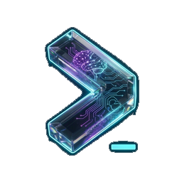

<p align="center"></p>

<h1 align="center">Scribe</h1>

<p align="center">A GPU-accelerated terminal emulator with a client-server architecture and first-class AI awareness.</p>

<p align="center">
  <a href="#license"></a>
  <a href="https://www.rust-lang.org/"></a>
</p>

---

## Features

- [Client-Server Architecture](#client-server-architecture)
- [Zero-Downtime Upgrades](#zero-downtime-upgrades)
- [AI / LLM Process Awareness](#ai--llm-process-awareness)
- [Prompt Bar](#prompt-bar)
- [Clipboard Cleanup](#clipboard-cleanup)
- [Cold Restart Restore](#cold-restart-restore)
- [GPU-Accelerated Rendering](#gpu-accelerated-rendering)
- [Shell Integration](#shell-integration)
- [Command Palette](#command-palette)
- [Workspaces](#workspaces)
- [Panes](#panes)
- [Tabs](#tabs)
- [Session Persistence](#session-persistence)
- [Themes](#themes)
- [Configurable Keybindings](#configurable-keybindings)
- [Settings UI](#settings-ui)
- [URL & Path Detection](#url--path-detection)
- [Drag and Drop](#drag-and-drop)
- [Scrollbar](#scrollbar)
- [System Stats](#system-stats)
- [Multi-Window Support](#multi-window-support)
- [IPC Security](#ipc-security)

## Why Scribe?

Crash your terminal, lose every shell. Update it, same story. Scribe splits the terminal into a headless server that owns your sessions and a GPU client that connects on demand — so your shells, tunnels, and builds are never at risk.

- **Unkillable sessions** — close the lid, crash the client, come back days later. Your scrollback and cursor are exactly where you left them.
- **AI agent awareness** — the status bar shows your agent's state, active tool, model, and context usage in real time. A prompt bar tracks your conversation. Copied text is auto-cleaned of hard wraps and indentation artifacts. No window-switching needed.
- **Zero-downtime upgrades** — the running server hands PTY file descriptors to the new binary. Your shells don't notice.
- **GPU rendering** — wgpu-powered (Vulkan / Metal / OpenGL ES), single draw call, smooth at any pane count or DPI.
- **Cold restart recovery** — if the server crashes, layout, tabs, pane splits, and AI conversation IDs are restored on next launch.

## Quick Start

### Prerequisites

- Rust 1.87+
- Linux: `libgtk-4-dev`, `libvulkan-dev`
- macOS: Xcode Command Line Tools

### Build from source

```bash
git clone https://github.com/scribe-terminal/scribe
cd scribe
just build-release
```

### Run

```bash
just server &   # start the PTY server
just client     # launch the GPU client
```

### Install on Linux (Debian/Ubuntu)

```bash
just install    # builds, packages .deb, and installs
```

### Install on macOS

```bash
just dmg        # builds .app bundle and .dmg installer
```

## Configuration

Scribe reads its configuration from `~/.config/scribe/config.toml`. Both the server and client share the same config file.

```toml
[appearance]
font = "JetBrains Mono"
font_size = 14.0
theme = "catppuccin-mocha"
opacity = 1.0
cursor_shape = "block"

[terminal]
scrollback_lines = 10000
copy_on_select = true
claude_code_integration = true

[workspaces]
roots = ["~/work", "~/projects"]
```

Open the graphical settings editor with `Ctrl+,` to modify configuration without editing the file directly.

## Keyboard Shortcuts

### Panes

| Action | Default Shortcut |
|--------|-----------------|
| Split vertical | `Ctrl+Shift+\` |
| Split horizontal | `Ctrl+Shift+-` |
| Close pane | `Ctrl+Shift+W` |
| Cycle focus | `Ctrl+Tab` |
| Focus direction | `Ctrl+Alt+Arrow` |

### Workspaces

| Action | Default Shortcut |
|--------|-----------------|
| Split workspace vertical | `Ctrl+Alt+\` |
| Split workspace horizontal | `Ctrl+Alt+-` |
| Cycle workspace | `Ctrl+Alt+Tab` |

### Tabs

| Action | Default Shortcut |
|--------|-----------------|
| New tab | `Ctrl+Shift+T` |
| Close tab | `Ctrl+Shift+Q` |
| Next/Previous tab | `Ctrl+PageDown/Up` |
| Select tab 1-9 | `Ctrl+1-9` |

### General

| Action | Default Shortcut |
|--------|-----------------|
| Copy | `Ctrl+Shift+C` |
| Paste | `Ctrl+Shift+V` |
| Zoom in/out/reset | `Ctrl+=/-/0` |
| Settings | `Ctrl+,` |
| New window | `Ctrl+Shift+N` |

All keybindings are fully configurable in `config.toml` under `[keybindings]`.

## Feature Details

### Client-Server Architecture

Scribe separates the terminal into two processes: `scribe-server` manages PTY sessions, and `scribe-client` provides the GPU-rendered UI. They communicate over a Unix domain socket (`/run/user/{uid}/scribe/server.sock`) using length-prefixed msgpack serialization. The server runs as a systemd user service. Clients are stateless and replaceable — crash one, start another, and reattach to your sessions instantly.

### Zero-Downtime Upgrades

When a new server binary is available, the running server hands off all PTY file descriptors and serialized session state to the new process via `SCM_RIGHTS` on a dedicated handoff socket (`/run/user/{uid}/scribe/handoff.sock`). The new server reconstructs sessions, workspaces, and pane layouts from the handoff state. Supports up to 256 PTY file descriptors and 16 MiB of serialized state. Triggered via `scribe-server --upgrade`.

### AI / LLM Process Awareness

Scribe natively parses OSC 1337 escape sequences emitted by AI coding tools like Claude Code. It tracks four AI states: idle/prompt, processing, waiting for permission, and error. Metadata includes the active tool, agent name, model, and context window usage percentage. The status bar surfaces this information in real time, giving developers instant visibility into their AI agent's state without switching windows.

### Prompt Bar

A per-pane bar that tracks AI prompts at the top or bottom of the terminal content. Shows the first and latest prompt with icons, and a prompt count. Click a prompt line to copy it; click the dismiss button to hide the bar until a new conversation starts. Font size, position, and colors are all configurable in settings.

### Clipboard Cleanup

When copying text from a Claude Code or Codex session, Scribe automatically strips common leading whitespace (dedent) and joins hard-wrapped prose lines (unwrap). Structural elements — bullets, headings, code blocks, tables — are preserved. The result is clean, paste-ready text without manual reformatting.

### Cold Restart Restore

If the server crashes, the client restores your full window layout on next launch. Workspace splits, tabs, pane trees, and per-pane launch commands are persisted after every layout change. AI panes also save their `conversation_id`, so resumed sessions can pick up the prior conversation directly.

### Shell Integration

Scribe detects your shell (Bash, Zsh, Fish, Nushell, PowerShell) and injects lightweight startup scripts that emit OSC escape sequences for prompt marks, working directory, and session context. This powers features like the status bar CWD, scrollbar prompt indicators, and remote host display.

### Command Palette

A GPU-rendered fuzzy action picker opened via keybinding. Lists settings, pane/tab/workspace actions, saved profiles, and available updates. Entries execute through the same handlers as keyboard shortcuts, so every command-palette action is also automatable via the CLI.

### GPU-Accelerated Rendering

Built on wgpu with backends for Vulkan, Metal, and OpenGL ES. Text is shaped by cosmic-text with a shared glyph atlas across all panes. All visible panes are rendered in a single instance-buffered draw call per frame. Supports font ligatures, variable font weight, configurable cursor shapes (block/underline/bar), and cursor blink.

### Workspaces

Workspaces split the window into independent regions, each with its own tab bar and pane layout. They are always visible side by side — never tabbed or hidden. Auto-naming matches session working directories against configured `workspace_roots` to name workspaces from the project directory. Workspace badges (colored dots) appear in the tab bar when multiple workspaces are open.

### Panes

Panes split the active tab's content area using a binary tree layout. Split vertically (side-by-side) or horizontally (top/bottom). Navigate between panes with directional focus (`Ctrl+Alt+Arrow`) or cycle through them with `Ctrl+Tab`. Dividers are draggable for custom sizing.

### Tabs

Each workspace has its own tab bar with independent sessions. Create, close, and switch tabs with keyboard shortcuts. Direct tab selection via `Ctrl+1` through `Ctrl+9`. Tabs display the session title derived from OSC 0/2 escape sequences.

### Session Persistence

Sessions are owned by the server and survive client disconnects. The PTY reader task continues feeding the terminal state even when no client is attached. On reconnect, the client sends `AttachSessions` and receives a `ScreenSnapshot` — a full ANSI-encoded dump of the visible terminal content. Scrollback, cursor position, and all terminal state are preserved.

### Themes

Ships with 5 curated presets (Minimal Dark, Tokyo Night, Catppuccin Mocha, Dracula, Solarized Dark) plus 187 community presets imported from popular terminal color schemes. Themes control both terminal ANSI colors and UI chrome (tab bar, status bar, dividers, accent colors). Custom themes can be defined inline in `config.toml` or loaded from external `.toml` files.

### Configurable Keybindings

Every keyboard shortcut is configurable in `config.toml` under `[keybindings]`. Each action supports up to 5 alternative key combinations. Accepts both single strings and arrays: `close_pane = "ctrl+shift+w"` or `close_pane = ["ctrl+shift+w", "ctrl+w"]`. Over 30 bindable actions covering panes, workspaces, tabs, clipboard, zoom, and terminal navigation.

### Settings UI

A standalone settings window (`scribe-settings`) opens with `Ctrl+,`. Built as a webview using wry with HTML/CSS/JS. Changes are applied live without restarting. Singleton-enforced — opening settings twice focuses the existing window. Covers appearance, terminal behavior, keybindings, and workspace configuration.

### URL & Path Detection

Ctrl+click opens URLs (http, https, ftp, file) and file-system paths detected in terminal output. File paths with a `:N` line-number suffix open in VS Code at that line. Relative paths resolve against the pane's working directory. Only the hovered span is underlined, and the pointer cursor appears while Ctrl is held.

### Drag and Drop

Drop files or directories onto a pane to insert their paths into the shell. Paths are quoted for the session's actual shell (POSIX, Fish, PowerShell, or Nushell) with a trailing space.

### Scrollbar

macOS-style overlay scrollbar that fades in on scroll activity and fades out after 1.5 seconds of inactivity. Supports click-to-jump and drag-to-scroll. Minimal visual footprint with smooth opacity transitions (0.3s fade duration).

### System Stats

CPU, memory, GPU, and network sparklines in the status bar, refreshed every 2 seconds. GPU detection reads AMD sysfs or NVIDIA sysfs/nvidia-smi on Linux. Individually toggleable in settings.

### Multi-Window Support

Open additional terminal windows with `Ctrl+Shift+N`. Each window connects independently to the server. The server tracks window ownership for session management. Windows share the same session pool — a session can be moved between windows.

### IPC Security

Both the main IPC socket and the handoff socket verify the connecting peer's UID via `SO_PEERCRED`. Connections from different users are rejected. Socket directories are created with `0700` permissions. All sockets are located under `/run/user/{uid}/scribe/`.

## Architecture

```
crates/
├── scribe-common     # Shared types: protocol, config, themes, IDs
├── scribe-pty        # PTY I/O, OSC interceptor, metadata parser
├── scribe-server     # Session/workspace management, IPC, handoff
├── scribe-client     # GPU client: winit + wgpu, pane layout, input
├── scribe-renderer   # GPU pipeline: glyph atlas, color palette, wgpu
├── scribe-settings   # Settings webview: wry, HTML/CSS/JS assets
├── scribe-cli        # Headless test CLI: raw stdin/stdout over IPC
└── scribe-test       # E2E test harness with subcommands
```

The client sends `ClientMessage` (key input, resize, session operations) serialized as length-prefixed msgpack over a Unix domain socket. The server responds with `ServerMessage` (PTY output, screen snapshots, metadata changes) using the same framing. Terminal emulation state is managed server-side by `alacritty_terminal`, with a parallel OSC interceptor for AI-specific escape sequences.

## License

Scribe is dual-licensed under [MIT](https://opensource.org/licenses/MIT) and [Apache 2.0](https://www.apache.org/licenses/LICENSE-2.0).
