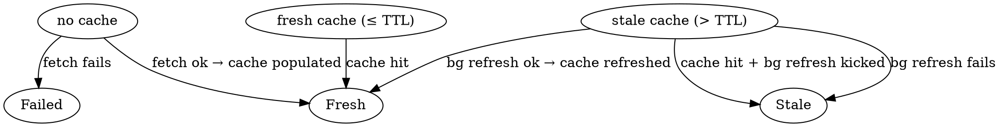

# Phase 1 Data Model: Releases Page

**Feature**: 001-releases-page
**Date**: 2026-05-09
**Spec**: [spec.md](./spec.md) | **Plan**: [plan.md](./plan.md) | **Research**: [research.md](./research.md)

This document defines the data shapes the feature introduces. It deliberately uses Rust-flavored notation because the feature is implemented in Rust and the entities cross a serde-msgpack IPC boundary; the same shapes are mirrored in the protocol contract under `contracts/releases-protocol.md`.

## Overview

Three new owned entities are introduced. They live entirely in `scribe-common` (so both the server and the settings binary can deserialize them) and are produced and cached on the server side.

```text
ReleaseListResultState (enum)
├── Fresh   { releases: Vec<Release> }
├── Stale   { releases: Vec<Release>, reason: String }
└── Failed  { reason: String }

Release (struct)
├── version       : String
├── name          : Option<String>
├── published_at  : String           // ISO-8601 from GitHub, kept verbatim
├── body_html     : String           // markdown→HTML→sanitized
├── prerelease    : bool
└── html_url      : String

ReleaseCatalog (server-only, not on wire)
├── last_fetched_at : Option<Instant>
├── last_fetch_was_success : bool
├── value           : Option<Vec<Release>>
└── ttl             : Duration
```

## Entity: Release

**Where it lives**: `scribe-common::protocol::Release` (new). Re-exported wherever `ServerMessage` is used.

**Purpose**: One published Scribe version, in the shape the settings webview can render directly.

**Fields**:

| Field | Type | Origin | Required | Notes |
|---|---|---|---|---|
| `version` | `String` | GitHub `tag_name`, leading `v` stripped (matches existing updater convention; see research R9) | yes | Used both as the list label and as the React-style identity key on the JS side. |
| `name` | `Option<String>` | GitHub `name` field on the release | no | Many GitHub releases set `name == tag_name`, in which case the JS deduplicates display. |
| `published_at` | `String` | GitHub `published_at` (ISO-8601) | yes | Stored verbatim. Display formatting (`YYYY-MM-DD` UTC, see research R9) is done on the JS side. |
| `body_html` | `String` | Server-side: GitHub `body` → `pulldown-cmark` → `ammonia` | yes | Already sanitized when it crosses the IPC boundary. The webview treats it as read-only display content. |
| `prerelease` | `bool` | GitHub `prerelease` | yes | Drives the "Pre-release" badge in the UI (FR-005). |
| `html_url` | `String` | GitHub `html_url` | yes | Used for an out-of-app "View on GitHub" link in the panel header. |

**Validation**:

- `version`: non-empty after the `v`-strip step. If GitHub returns an empty/missing `tag_name`, the release is dropped from the list before it reaches the wire.
- `body_html`: may be empty when the release notes were never written (FR edge case: "No release notes provided for this version" is rendered by the JS when this field is empty).
- `published_at`: any string; the JS treats unparseable values as "unknown date" and shows the version alone.
- `html_url`: non-empty; if missing, the "View on GitHub" link is hidden but the release still renders.

**Lifecycle**:

- Created from a successful `fetch_releases` call on `scribe-server` after running each release through the markdown→HTML→sanitize pipeline.
- Read-only thereafter.
- Lives only in memory; serialized through msgpack when the settings binary requests it via `ClientMessage::ListReleases`.

## Entity: ReleaseListResultState

**Where it lives**: `scribe-common::protocol::ReleaseListResultState` (new). Mirrors the shape of the existing `UpdateCheckResultState` in the same file.

**Purpose**: Single-shape carrier for the result of asking the server "give me the releases right now," covering the Fresh / Stale / Failed cases the UI must distinguish.

**Variants**:

| Variant | Payload | Meaning | UI consequence |
|---|---|---|---|
| `Fresh` | `{ releases: Vec<Release> }` | Cache was within TTL, or the synchronous on-demand fetch just succeeded. | List + selected notes render normally. No stale indicator. |
| `Stale` | `{ releases: Vec<Release>, reason: String }` | Cache existed but was past TTL; a background refresh was kicked off and either failed or has not completed. | List + selected notes render from the cached data with a visible "may be stale — last refreshed at … (reason: …)" indicator and a manual retry control. Satisfies FR-013. |
| `Failed` | `{ reason: String }` | No cache exists and the on-demand fetch failed (network, rate-limit, unexpected schema, …). | The panel shows a non-blocking error state with the `reason` text and a retry control. Satisfies FR-012. |

**Validation**:

- `releases` in `Fresh` and `Stale` is always a list (possibly empty if GitHub returned zero published releases — see FR edge case "repository has zero published releases").
- `reason` strings are user-presentable (the server takes care of mapping `reqwest` errors and rate-limit responses to plain-language strings before constructing the variant); the JS does not parse them.

**Lifecycle**:

- Always constructed by the server's `releases.rs` handler in response to `ClientMessage::ListReleases`. Never persisted.

**State transitions** (cache → wire variant):



## Entity: ReleaseCatalog (server-only)

**Where it lives**: `scribe-server::releases::ReleaseCatalog` (new). Not part of the protocol; never crosses the IPC boundary.

**Purpose**: The in-memory cache the server uses to back the responses described in research R4.

**Fields**:

| Field | Type | Notes |
|---|---|---|
| `last_fetched_at` | `Option<std::time::Instant>` | `None` until the first successful fetch. |
| `last_fetch_was_success` | `bool` | Lets us distinguish "we have data and it is current" from "we have data but the most recent attempt failed." |
| `value` | `Option<Vec<Release>>` | The cached release vector. `None` until the first successful fetch ever; remains `Some` thereafter even when refreshes fail. |
| `ttl` | `std::time::Duration` | 1 hour (research R4). Configurable for tests. |
| `inflight_refresh` | server-internal flag/handle | Prevents a thundering-herd if multiple `ListReleases` requests arrive while a background refresh is already in progress. |

**Lifecycle**:

- One per `scribe-server` process, created at server startup as part of the existing service-wiring path.
- Mutated only inside the releases handler, behind a `Mutex` or equivalent (the existing `scribe-server` uses `tokio::sync::Mutex` for similar single-writer state — see existing updater pattern for reference).
- Cleared on server restart. No persistence.

**Invariants**:

- If `value` is `Some(_)`, then `last_fetched_at` is also `Some(_)`.
- A `Stale` response is never produced when `value` is `None`; in that case `Failed` is produced instead.
- A `Fresh` response is never produced when `last_fetched_at`'s age exceeds `ttl`; the value is downgraded to `Stale` and a background refresh is scheduled.

## Settings webview state (browser-side, in `settings.js`)

Not a wire entity, but part of the data model for the feature. The webview owns:

- `releaseListState : "loading" | "ready" | "error" | "stale"` — drives which sub-view is rendered inside the `#releases-panel`.
- `releases : Release[]` — the most recent successful list, retained across releases-tab activations (so re-entering the tab in the same session does not re-render from scratch and does not re-IPC).
- `selectedReleaseVersion : string | null` — version string of the currently displayed release; defaults to the first item in `releases` on initial load.
- `releaseLastFetchedAt : ISO timestamp | null` — used to show "may be stale" copy in the `Stale` state.

This state is purely in-memory in the JS process and is not persisted.

## Cross-feature impact

- The existing `UpdateCheckResultState` enum and the existing `request_update_check` flow are not touched. The new `ReleaseListResultState` is intentionally parallel in structure (`Fresh`, failure, "stale-with-data") to keep the IPC mental model uniform.
- The existing `Release` (used internally in `updater.rs` as `GhRelease`) is a different type — it is the raw GitHub deserialization shape and is not exposed on the wire. The new `Release` defined here is the post-render, post-sanitize, wire-ready shape. They live at different layers and do not collide.
